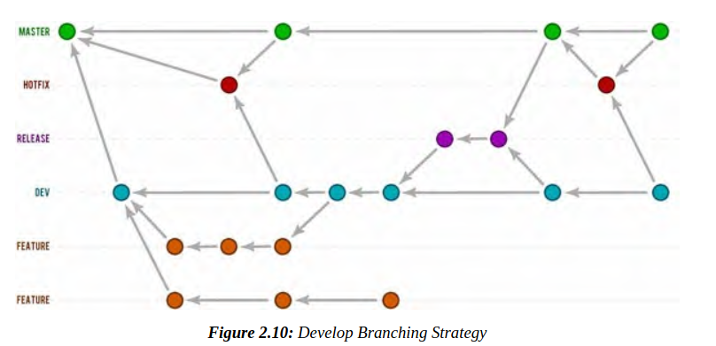

> I have quick note when reading book: [**CI-CD Pipeline with Docker and Jenkins. Learn How to Build and Manage Your CI-CD Pipelines Effectively (2023) by S. Rawat**](https://www.amazon.com/Pipeline-Docker-Jenkins-Pipelines-Effectively-ebook/dp/B0BS6BZP8Q) and have translate to vietnamese later.
>
> It's full of technical knowledge about how to transform code from developer to productions. Spoil: It's long journey with a lot of stages: from Development to QA, Security, Performance, Business tesing Environment.
>
> Each Environment have many stage too, if code fail in a single stage, it's back to start or simple throw out. Now, it's looklike a production in industry sector (and it does) 
>
> Good new are we can automation all (or almost) stages. Bad new is DevOps need have knowledge of wide range: form development, security, business ... That's what I love in DevOps. We've never stopped learning.
> 
<figure>

<figcaption>How to setup a CI/CD pipeline.  Photo by <a href="https://unsplash.com/@lazizli?utm_source=unsplash&utm_medium=referral&utm_content=creditCopyText">Lala Azizli</a> on <a href="https://unsplash.com/photos/tfNyTfJpKvc?utm_source=unsplash&utm_medium=referral&utm_content=creditCopyText">Unsplash</a>
  </figcaption>
</figure>

## Chapter 2

**Code stability**
Stability of code check means checking whether code is in a compliable state or if new changes are breaking already compliable code in any way. So, in code stability, we will compile the application code to check whether it is breaking the application

**Code quality**
Tools: SonarQube, Sonarscanner

**Testing, Code Coverage, and Security Testing**
Manage security: JFrog Artifactory, Sonatype Nexus, Pulp, and Archiva Cloudsmith Package

**DB Versioning**
- Update database is pain
- Data Definition Language (DDL) or Data Manipulation Language (DML)
- Database as Code 

**Testing**

- Smoking Test: like testing of basic application functionality and ease of deciding whether further testing is needed.

**Regression Testing**
Regression testing run the automated tests again to check the previously working functionality as well as the new functionalities. Typically, we do regression testing when new feature is introduced, when some of the bugs are fixed, during performance improvements, and during configuration level changes

Functional tests only inspect the behavior of new changes or features and do not check how much they are compatible with existing ones.Therefore, without regression testing, it would be very difficult and time-consuming to identify the root cause of product failure.”

Tools: Selenium, JMeter for load testing.

**API testing**

- We can find out the ways an end user may mess up by sending wrong data
- We can check the average response time of API to know if it is not too slow
- Request type validation, like request is POST, GET, or PUT can be passed while making a request
- We can check whether the request is authorized to make API call. Also, we can do status code validation
- We can prevent SQL injection as well using these tests

**Communication for Team**
- Email
- Slack
- Pagerduty
- Skype
- Jabber
- HipChat

**Branching Strategy**

I think there should be a development branch, and developers can create a feature branch from it.Once the code is reviewed and tested with the CI pipeline, we can merge that branch in the development branch, and from that development branch, we can create release branches to deploy code across different environments.
In case of bugs, a new hotfix branch will be created. From that, the release branch and fixes can be deployed from there

Other options:

We can have a development branch, and developers can create a feature branch from it once they are done with the feature. They will raise a Pull Request for the development branch, and then I can merge the code after review. Once the code is merged, the CI job will be executed to create and deploy the artifact. After the testing, a new Pull Request will be raised for the master branch, and once the Pull Request is merged, the code will be deployed in the production environment.
The developing branching strategy can be seen in the following figure

So if there is a bug, a new hotfix branch will be created from the master branch, and it will be merged with the master after testing. The development branch and features branches will take a pull from it for the latest code

**Points to Remember**

Generally, people divide continuous integration into two parts: pre-deployment checks and post-deployment checks.
- Pre-deployment checks, including code stability, code quality, unit tests,and code coverage and security tests
- Intermediate operations like artefact management and database versioning
- Post-deployment integrations with Smoke, Regression, and API tests
- Intelligent notification management
- Branching strategy overview

DB versioning is an important aspect of Continuous Integration if we want to achieve a complete automated CI pipeline.

Code coverage depends on the application test cases

## Chapter 3: Jenkins
Tools needed:
Version Control System Integrated Pipelines
- Gitlab CI/CD
- Github Action
- Bitbucket CI
Software as a Service
- TravisCI
- CircleCI
- CodeFresh
- Codeship
- Shippable
- Wercker
- Azure DevOps
- AWS DevOps
Self-hosted and Managed
- Jenkins, Teamcity, Bamboo, Travis, Circle, CodeShip

### Why Jenkins
- Easy Installation: Jenkins is a platform-agnostic, self-contained Java-based program ready to run with packages for Windows, Mac OS, and Unix-like operating systems.
- Easy Configuration: It is easily set up and configured using its web interface, featuring error checks and a built-in help function.
- Available Plugins: There are over a thousand plugins available in the Update Center, integrating with every tool in the CI and CD toolchain.
- Extensible: It can be extended utilizing its plugin architecture, providing nearly endless possibilities for what it can do.
- Easy Distribution: Jenkins can efficiently distribute work across multiple machines for faster builds, tests, and deployments across multiple platforms.
- Notification Support: Integrations available to notify the build status on various communication channels.
- Active community. The Jenkins community provides a guided tour introducing the basics and advanced tutorials for more sophisticated use of the tool.
- No expenses required: Jenkins is an open-source resource backed by
heavy community support.

**Plugin needed for Jenkins**
- Source code management
- WebUI
  - Folders
  - BlueOcean
- Administration: Agens and AuditTrail
- Build Management
  - Warnings Next Generation
  - HTML Publisher
  - SonarScanner
- Notification
  - Slack
  - Email
  - Microsoft Teams
- Authentication
  - Basic Auth, LDAP, SSO
- Authorization
  - Login User can do anything
  - Role base, matrix-base 

### Jenkins pipeline
Create first Jenkinfile and config Jenkins over github

## Chapter 4: CI with Jenkins
Full of techincal 

## Conclude

Software Development is not only Coding. It's have a lot of people and process: Project management, Propotype/webflow, Graphics/Content, Frontend/backend, and DevOps.

Here are google sheet that include steps to deploy a DevOps process: [CI/CD pipeline: Stages, test, tools](https://docs.google.com/spreadsheets/d/143-oCLbYMaJTyngbpgmLGt6SS09618EXo7VkoNbhJ0Q/edit?usp=sharing)
